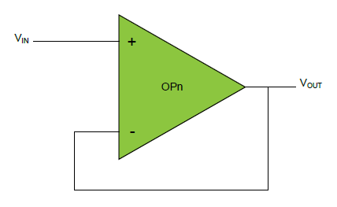

# Getting started with Mindi® simulation and PIC18-Q41 microcontrollers
This guide will get you up and running with simulating the analog OPAMP module in PIC18-Q41 family devices using the Mindi simulation tool.
## Configuration: Unity Gain Buffer (Voltage Follower)
A unity gain buffer is an opamp configuration in which the output voltage tracks the input voltage, also known as a voltage follower.

### Mindi Simulation

Download and open the follower **Mindi schematic [here](schematics/Voltage_Follower.wxsch)**

Press the _play_ button to simulate with an example stimulus source.

### Tweaking
A voltage follower has no adjustable resistor values.

### Updating composer fields
Once the desired result has been verified with Mindi simulation, the corrected values should be moved back into MCC/Start by copying resistor values across to the composer of your preference.

### Don't have Mindi?
Download and install [Mindi simulation tool](https://www.microchip.com/mplab/mplab-mindi)
Download and install Mindi model for AVR DB device
